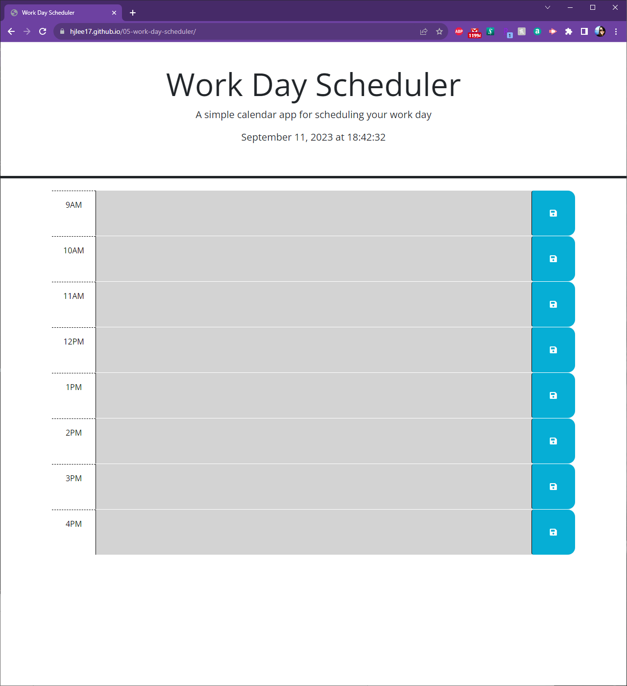

# 04-timed-javascript-fundamentals-quiz

## Description

Calendar application that allows a user to save events for each hour of a typical working day (9am–5pm). The application will display the current day and time. Timeblocks are color-coded to indicate whether it is in the past, present or future. Events are saved in the local storage.

## Installation

n/a

## Usage
Link to deployed application: https://hjlee17.github.io/05-work-day-scheduler/

A user can schedule and save events for each hour from 9am-5pm.

## Credits

BootCampSpot

## License

MIT License

Copyright (c) 2023 hjlee17

Permission is hereby granted, free of charge, to any person obtaining a copy
of this software and associated documentation files (the "Software"), to deal
in the Software without restriction, including without limitation the rights
to use, copy, modify, merge, publish, distribute, sublicense, and/or sell
copies of the Software, and to permit persons to whom the Software is
furnished to do so, subject to the following conditions:

The above copyright notice and this permission notice shall be included in all
copies or substantial portions of the Software.

THE SOFTWARE IS PROVIDED "AS IS", WITHOUT WARRANTY OF ANY KIND, EXPRESS OR
IMPLIED, INCLUDING BUT NOT LIMITED TO THE WARRANTIES OF MERCHANTABILITY,
FITNESS FOR A PARTICULAR PURPOSE AND NONINFRINGEMENT. IN NO EVENT SHALL THE
AUTHORS OR COPYRIGHT HOLDERS BE LIABLE FOR ANY CLAIM, DAMAGES OR OTHER
LIABILITY, WHETHER IN AN ACTION OF CONTRACT, TORT OR OTHERWISE, ARISING FROM,
OUT OF OR IN CONNECTION WITH THE SOFTWARE OR THE USE OR OTHER DEALINGS IN THE
SOFTWARE.